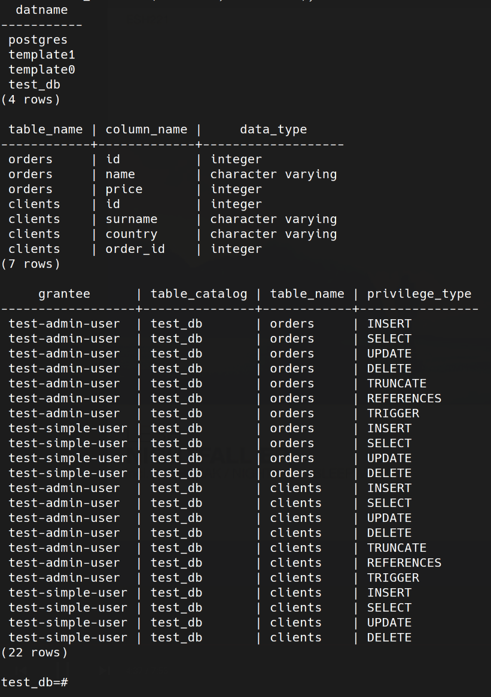

## 1
1. global - запускает один сервис на каждой ноде в единственном экземпляре, replica - запуск сервиса в определённорм количестве экземпляров (на одном сервере кластера может запуститься несколько или ни одного экземпляра) 
2. Используется алгоритм поддержания распределенного консенсуса - RAFT. 
3. Overlay-сети используются в контексте кластеров, где виртуальная сеть, которую используют контейнеры, связывает несколько физических хостов, на которых запущен Docker. Overlay-сеть создает подсеть, которую могут использовать контейнеры в разных хостах swarm-кластера. Контейнеры на разных физических хостах могут обмениваться данными по overlay-сети. 
## 2

## 3

