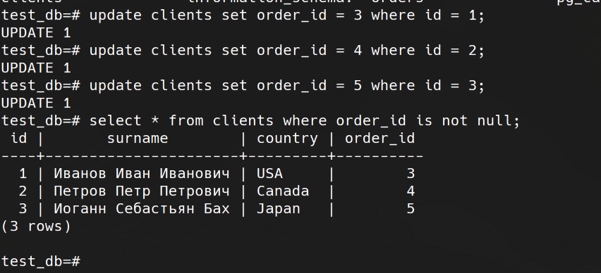
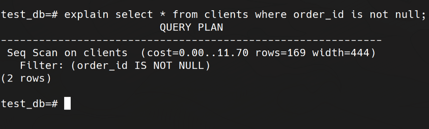
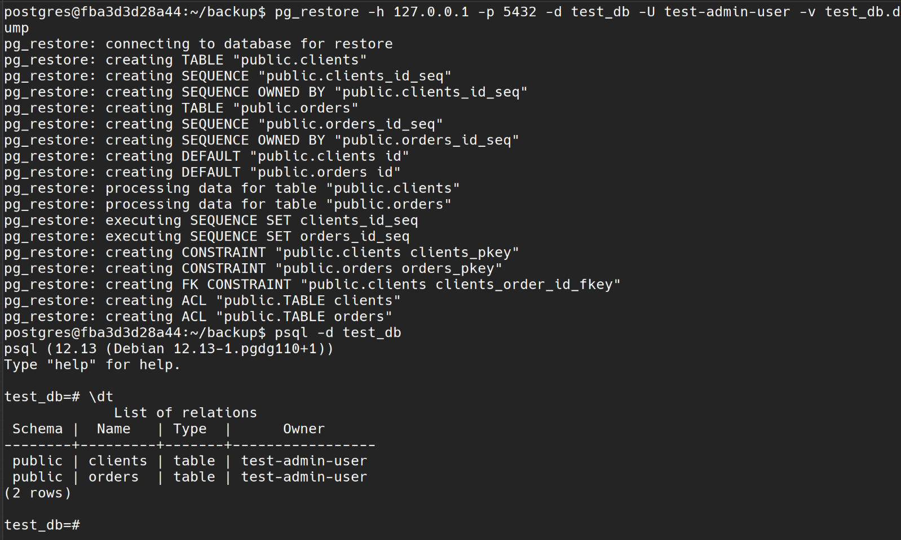

## 1
[Compose](./src/docker-compose.yaml)

## 2

## 3
[Запросы](./src/insert.sql)

## 4

## 5

 - Приблизительная стоимость запуска. Это время, которое проходит, прежде чем начнётся этап вывода данных, например для сортирующего узла это время сортировки.
 - Приблизительная общая стоимость. Она вычисляется в предположении, что узел плана выполняется до конца, то есть возвращает все доступные строки.
 - Ожидаемое число строк, которое должен вывести этот узел плана. При этом так же предполагается, что узел выполняется до конца.
 - Ожидаемый средний размер строк, выводимых этим узлом плана.
 
## 6
Бекап делал с помощью
'pg_dump -h 127.0.0.1 -p 5432 --format custom --blobs -U test-admin-user -d test_db -v -f test_db.dump'
После создания нового контейнера инит базы с нуля - создание бд, пользователей

