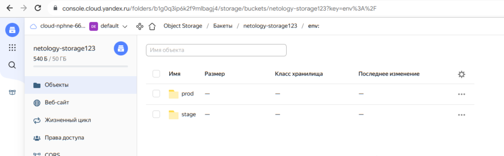
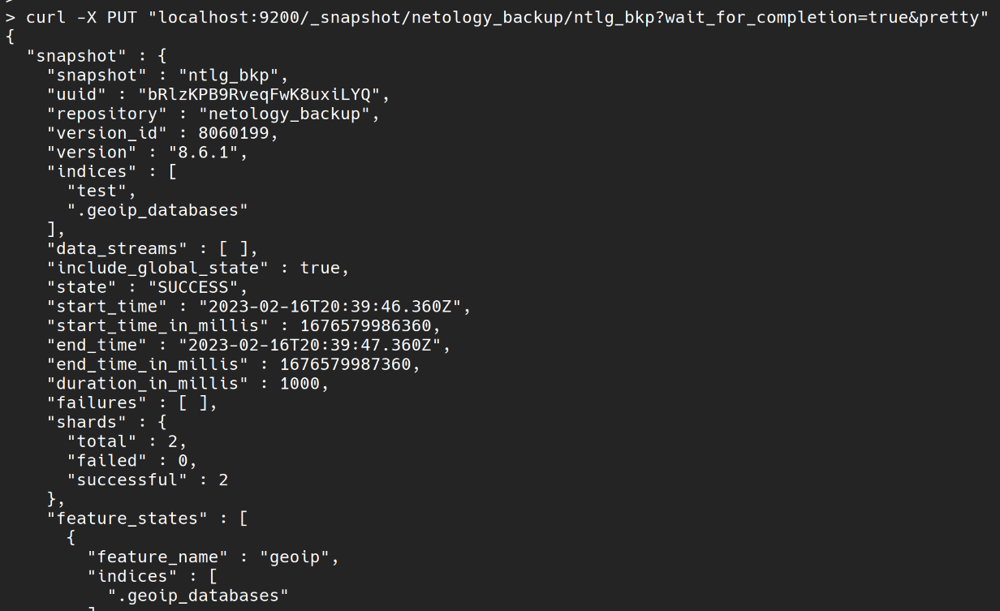
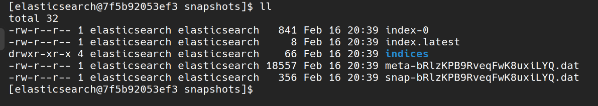
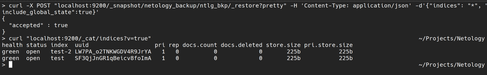

## 1
```
FROM centos:7

USER 0
ENV ES_HOME="/var/lib/elasticsearch"
RUN useradd -m -u 1000 elasticsearch
ADD elasticsearch/ ${ES_HOME}
ADD config/* ${ES_HOME}/config/
RUN mkdir -pv /var/lib/elasticsearch/{data,logs,snapshots} 
RUN chown -R elasticsearch:elasticsearch ${ES_HOME}  
  
USER 1000
ENV ES_HOME="/var/lib/elasticsearch" \
    ES_PATH_CONF="/var/lib/elasticsearch/config"
WORKDIR ${ES_HOME}

CMD ["sh", "-c", "${ES_HOME}/bin/elasticsearch"]
EXPOSE 9200 9300
```
[Hub](https://hub.docker.com/repository/docker/kitakami23/ntlg-elastic/general)



## 2


Статус жёлтый, т.к в кластере с одной нодой негде размещать реплики.

## 3
Запрос API и результат вызова API для создания репозитория
```
curl -X PUT "localhost:9200/_snapshot/netology_backup?pretty" -H 'Content-Type: application/json' -d '{"type": "fs","settings": {"location": "/var/lib/elasticsearch/snapshots"}}'
curl -X GET "localhost:9200/_snapshot/netology_backup?pretty"
```
Индекс test с 0 реплик и 1 шардом, директории со snapshot`ами
```
curl -X PUT localhost:9200/test -H 'Content-Type: application/json' -d '{"settings": {"number_of_shards": 1, "number_of_replicas": 0}}'
curl -X PUT "localhost:9200/_snapshot/netology_backup/ntlg_bkp?wait_for_completion=true&pretty"
```



Удалить индекс test и создать индекс test-2
```
curl -X DELETE "localhost:9200/test?pretty"
curl -X PUT localhost:9200/test-2 -H 'Content-Type: application/json' -d '{"settings": {"number_of_shards": 1, "number_of_replicas": 0}}'
curl -X POST "localhost:9200/_snapshot/netology_backup/ntlg_bkp/_restore?pretty" -H 'Content-Type: application/json' -d'{"indices": "*", "include_global_state":true}'
```

