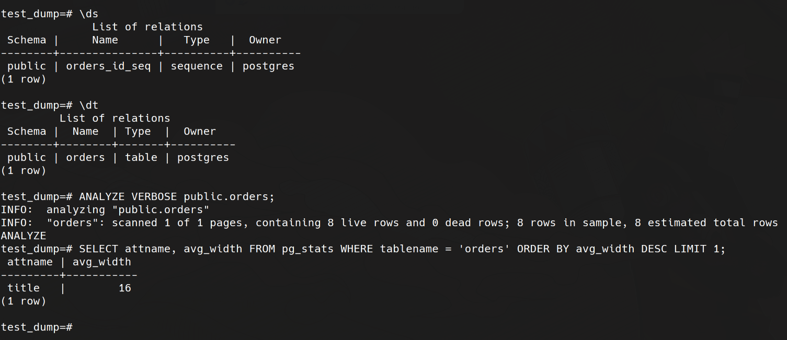

## 1
```
\l  - список бд
\c  - подключиться к бд
\dt - список таблиц
\d  - описание
\q  - выход
```

## 2




## 3

```
ALTER TABLE public.orders RENAME TO orders_old;

CREATE TABLE public.orders (
    LIKE public.orders_old
) PARTITION BY RANGE(price);

CREATE TABLE public.orders_1 
PARTITION OF public.orders 
FOR VALUES FROM (0) TO (499);

CREATE TABLE public.orders_2 
PARTITION OF public.orders 
FOR VALUES FROM (499) TO (999999999);


INSERT INTO public.orders (id, title, price) 
SELECT * FROM public.orders_old;

ALTER TABLE public.orders_old ALTER id DROP DEFAULT;
ALTER SEQUENCE public.orders_id_seq OWNED BY public.orders.id;

DROP TABLE public.orders_old;
```


## 4

Бекап
```
pg_dump -h 127.0.0.1 -p 5432 -U postgres -d test_dump > /var/lib/postgresql/backup/parttdb.sql -v
```

Доработка в файл бекапа с разделом в создании таблицы

```
CREATE TABLE public.orders (
    id integer NOT NULL,
    title character varying(80) UNIQUE NOT NULL,
    price integer DEFAULT 0
)
```

